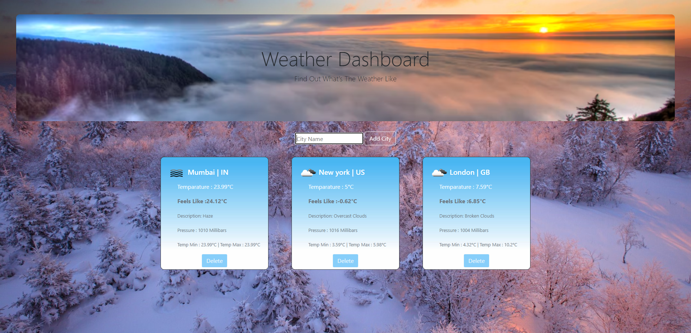

## :sunny: Weather-dashboard-using-flask :cloud:
## Made as a Final Project For CS50x
#### Video Demo:  <URL HERE>
#### Description:
The Weather Dashboard App is a simple web application built using Flask, Python, HTML, CSS, and SQLite. It provides users with real-time weather information for multiple cities using the OpenWeatherMap API. Users can add new cities to track their weather conditions and view a summary of temperature, description, and an icon representing the weather.
#### Features:
* Display real-time weather information for multiple cities.
* Add new cities to the dashboard.
* Information includes temperature, description, and weather icon.
* Persistent storage of added cities using SQLite.
#### TODO to run the application type the followingg command in CMD :
```flask run```
<br>
<br>
